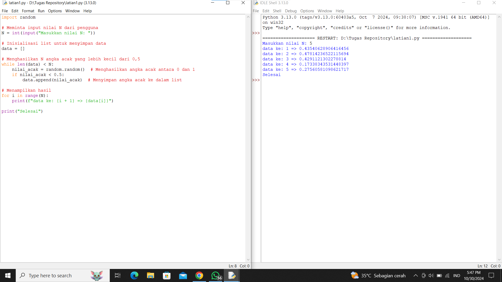
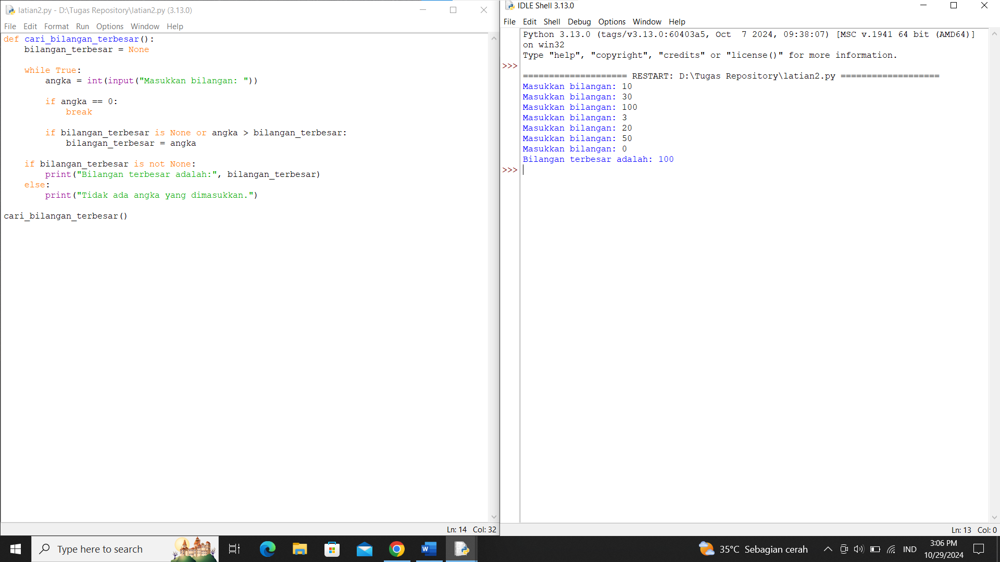
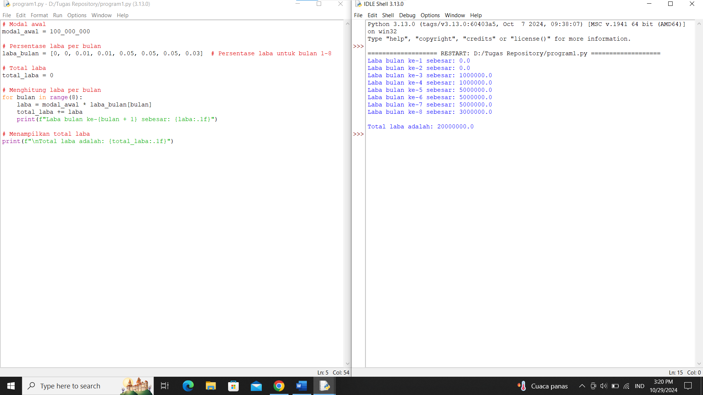

# Algoritma latian 1
1. input = minta pengguna masukkan nilai N
2. inisialisasi = buat list kosong untuk menyimpan data
3. proses =

     a. lakukan pengulangan sampai nilai dalam list mencapai N

     b. hasilkan nilai acak dengan fungsi random

     c. jika nilai acak kurang dari 0.5, tambahkan ke dalam list
4. output = menghasilkan nilai acak yang kurang dari 0.5 dalam list sebanyak N dan print selesai.

# Screenshoot Latian 1

# Algoritma latian 2
1. Inisialisasi : Buat variabel bilangan_terbesar dan set nilainya ke None.
2. Input pengulangan : Minta pengguna memasukkan bilangan ke dalam loop pengulangan.
3. proses:

     a. Jika angka sama dengan 0, hentikan loop.

     b. Jika bilangan_terbesar adalah None (belum ada bilangan yang dimasukkan) atau jika angka lebih besar dari bilangan_terbesar, maka:
Perbarui bilangan_terbesar dengan nilai angka.
4. Output : Setelah keluar dari loop, periksa:
Jika bilangan_terbesar tidak None, tampilkan "Bilangan terbesar adalah: [nilai bilangan terbesar]".
Jika bilangan_terbesar masih None, tampilkan pesan "Tidak ada angka yang dimasukkan."

# Screenshoot Latian 2

# Algoritma program 1
1. input =

   a. masukkan nilai modal awal

   b. buat list yaang berisi presentase laba per bulan

   c. inisialisasi total laba dengan 0
3. proses =

   a. hitung laba dengan mengkalikan modal awal dengan presentase laba

   b. tampilkan nilai laba setiap bulannya
4. Output = tampilkan total keseluruhuan laba yang telah dihitung

# Screenshoot Program 1

